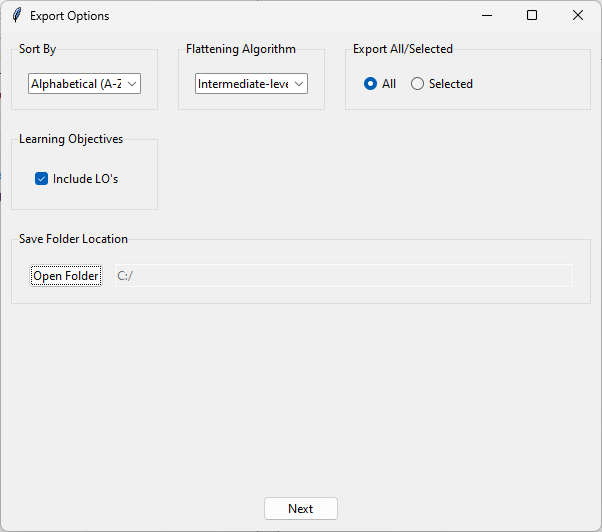

# Sofia Scraper
<div style="display: flex; flex-direction: row; align-items: flex-start; justify-content: center">
  
  
</div>

## 🚩 Table of Contents
- [Installation](#️⚙️-installation)
    - [Prerequisites](#prerequisites)
- [Running the Application](#🚀-running-the-application)
- [Notice](#⚠️-notice)
- [License](#📜-license)


## ⚙️ Installation

### Prerequisites
- Ensure you have **Python 3** installed. You can download it from python.org.

### Clone the Repository
```sh
git clone https://github.com/ethch19/sofiascraper.git
cd sofiascraper
```

### Install Dependencies

#### Linux/MacOs
```sh
python3 -m pip install -r requirements.txt
```

#### Windows
```sh
py -m pip install -r requirements.txt
```

## 🚀 Running the Application

### Linux/MacOS
```sh
python3 ui.py
```

### Windows
```sh
py ui.py
```

## ⚠️ Notice

1. **Unstable Features**: This is a quick project, so there are unstable features.
2. **Bug Reporting**: Please report bugs via the issues page, but note that it is unlikely they will be fixed.
3. **Contributions**: The best way to improve this project is to fork it, fix the issues yourself, and then make a pull request.

## 📜 License

Distributed under the GPL-3.0 License. See `LICENSE` for more information.
